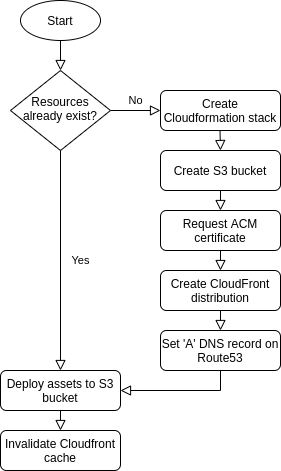

<h1 align="center">
  Deploy static site to AWS
  <br>
</h1>

<h4 align="center">Batteries-included Github action that deploys a static site to AWS Cloudfront, taking care of DNS, SSL certs and S3 buckets</h4>

<p align="center">
  
</p>

## Usage
```
- name: Deploy to AWS
  uses: onramper/action-deploy-aws-static-site@v1
  with:
    AWS_ACCESS_KEY_ID: ${{ secrets.AWS_ACCESS_KEY_ID }}
    AWS_SECRET_ACCESS_KEY: ${{ secrets.AWS_SECRET_ACCESS_KEY }}
    domain: subdomain.example.com
    publish_dir: ./public
```

## Privacy

This Action contacts Chainguard's licensing server to verify authorization. Connection metadata (IP address, GitHub repository identifier, timestamp, and any metadata encoded in the auth token) is transmitted to Chainguard, Inc. even if authorization is denied in accordance with our [Privacy Notice](https://www.chainguard.dev/legal/privacy-notice)
